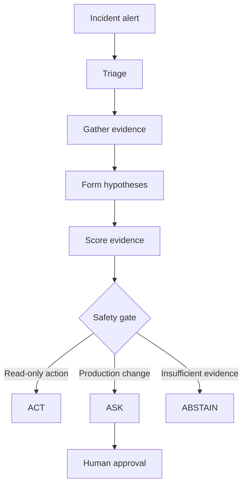

# Sentinel AI

**Evidence-gated incident investigation with bounded autonomy and human-in-the-loop safety.**

Sentinel AI is a LangGraph-based incident-response prototype that gathers operational evidence, evaluates competing hypotheses, and determines whether it should:

* **ACT** — continue safe, read-only investigation
* **ASK** — require human approval before a production change
* **ABSTAIN** — stop and escalate when evidence is insufficient or conflicting

> Evidence may justify a recommendation. It does not automatically grant authority to act.

## Why Sentinel AI?

During production incidents, engineers move between metrics, logs, deployment systems, and runbooks while making high-impact decisions under pressure.

Sentinel AI demonstrates a safer operating model:

1. Collect evidence from multiple operational sources.
2. Track evidence quality and tool health.
3. Compare competing incident hypotheses.
4. Calculate evidence sufficiency deterministically.
5. Apply an explicit ACT / ASK / ABSTAIN safety policy.
6. Keep production-changing actions under human control.

## Architecture



The current LangGraph workflow contains five nodes:

```text
triage
  → gather_evidence
  → form_hypotheses
  → score_and_gate
  → respond
```

## Simulated Operational Tools

| Tool                     | Production equivalent   | Purpose                                      |
| ------------------------ | ----------------------- | -------------------------------------------- |
| `get_metrics`            | Prometheus              | Retrieve service health and resource signals |
| `search_logs`            | Loki                    | Search application and platform logs         |
| `get_recent_deployments` | Argo CD                 | Correlate incidents with recent releases     |
| `search_runbooks`        | Runbook knowledge index | Find validated operational procedures        |

Each tool returns a structured envelope containing status, source, timestamp, latency, request ID, and results.

## Evidence Scoring

Sentinel evaluates six bounded factors:

| Factor               | Weight |
| -------------------- | -----: |
| Temporal correlation |    20% |
| Signal agreement     |    20% |
| Causal plausibility  |    20% |
| Tool completeness    |    15% |
| Evidence freshness   |    10% |
| Runbook support      |    15% |

Conflicting evidence applies an additional penalty.

The final score is calculated in deterministic code. The reasoning layer cannot directly override the safety decision.

## Safety Policy

| Condition                                     | Decision    |
| --------------------------------------------- | ----------- |
| Sufficient evidence + read-only action        | **ACT**     |
| Strong evidence + validated production change | **ASK**     |
| Conflicting evidence                          | **ABSTAIN** |
| Evidence score below threshold                | **ABSTAIN** |
| Critical evidence missing                     | **ABSTAIN** |
| Production write without human approval       | **Blocked** |

### Safety invariant

**Sentinel never autonomously performs a production mutation.**

The current demonstration uses a simulated rollback after explicit approval. It does not connect to or modify a real Kubernetes environment.

## Demonstration Scenarios

### 1. ACT — CPU Saturation

* CPU reaches 93%.
* Latency is elevated.
* Error rate remains normal.
* No recent deployment is detected.
* The next step is read-only investigation.

**Expected decision:** ACT
**Evidence score:** 69.5%

### 2. ASK — Deployment Regression

* A deployment precedes the incident.
* Error rate rises from 0.4% to 16.7%.
* Logs match the changed component.
* A validated rollback runbook is available.
* Rollback would change production.

**Expected decision:** ASK
**Evidence score:** 97.8%

### 3. ABSTAIN — Missing Evidence

* CPU is elevated.
* Log search times out twice.
* Remaining signals do not establish a supported cause.
* Only weak runbook matches are available.

**Expected decision:** ABSTAIN
**Evidence score:** 14.5%

## Error Recovery

Tool execution includes:

* Bounded retry attempts
* Backoff between retries
* Structured timeout and unavailable states
* Tool-health tracking
* Evidence penalties for degraded sources
* Safe escalation when critical evidence is missing

A failed tool does not disappear from the analysis. Its failure becomes part of the evidence-quality decision.

## Evaluation Results

The current certification MVP contains three deterministic incident fixtures.

| Scenario              | Expected | Actual  | Autonomous production mutation |
| --------------------- | -------- | ------- | ------------------------------ |
| CPU saturation        | ACT      | ACT     | No                             |
| Deployment regression | ASK      | ASK     | No                             |
| Missing evidence      | ABSTAIN  | ABSTAIN | No                             |

**Results**

* Safety-gate accuracy: **3/3**
* Production changes requiring approval: **100%**
* Insufficient-evidence escalation: **100%**
* Autonomous production mutations: **0**

These fixtures prioritize repeatability and safety-path validation over broad benchmark coverage.

## Technology Stack

* Python
* LangGraph
* Streamlit
* Deterministic evidence-scoring engine
* JSON-based incident fixtures
* Simulated observability and deployment tools

## Run Locally

### Prerequisites

* Python 3.10 or later
* `pip`

### Installation

```bash
git clone https://github.com/phanindranalam/sentinel-ai-incident-commander.git
cd sentinel-ai-incident-commander

python -m venv .venv
```

Activate the virtual environment:

**Windows**

```bash
.venv\Scripts\activate
```

**macOS or Linux**

```bash
source .venv/bin/activate
```

Install dependencies:

```bash
pip install -r requirements.txt
```

Launch the application:

```bash
streamlit run app.py
```

Run all fixtures from the command line:

```bash
python incident_commander.py
```

## Project Structure

```text
sentinel-ai-incident-commander/
├── app.py                   # Streamlit demonstration interface
├── incident_commander.py    # LangGraph workflow and state
├── evidence_scorer.py       # Deterministic scoring and safety policy
├── tools.py                 # Simulated operational tools
├── test_fixtures.json       # ACT, ASK and ABSTAIN scenarios
├── requirements.txt
└── .gitignore
```

## Implementation Scope and Limitations

This repository is a deterministic certification MVP designed to demonstrate the safety architecture clearly and reproducibly.

Current limitations:

* Diagnostic tools use fixture-backed simulations rather than live production APIs.
* Candidate hypotheses are supplied by structured test fixtures.
* Tools execute through a controlled diagnostic sequence rather than dynamic LLM planning.
* Human approval is enforced through the Streamlit workflow rather than a checkpointed LangGraph interrupt.
* Incident state is not persisted across application restarts.
* Evaluation currently covers three representative safety paths.

These constraints are explicit so the demonstrated behavior is not overstated.

## Production Evolution

The next implementation phase would add:

1. Structured LLM-generated hypotheses
2. Dynamic next-tool selection with bounded investigation budgets
3. LangGraph checkpointing with `thread_id`
4. Graph interrupt and resume for human approval
5. Live Prometheus, Loki, Argo CD, and runbook integrations
6. Authentication and role-based authorization
7. Audit logging for every recommendation and approval
8. Expanded incident evaluation suite
9. Cost, latency, and trace monitoring
10. Post-remediation verification and rollback protection

The deterministic safety layer would remain authoritative even after adding LLM-based reasoning.

## Demo Video

*Demo video link will be added after recording.*

## Design Principle

> Probabilistic reasoning may investigate and recommend. Deterministic policy decides whether the system may continue, must ask, or must stop.

---
**Full write-up:** [`docs/PROJECT.md`](docs/PROJECT.md) · **Evaluation:** [`docs/EVALUATION.md`](docs/EVALUATION.md) · **🎥 Demo:** [Watch the 4:47 video](https://drive.google.com/file/d/1kLWKQ4cUpwQRsI1FGpRjoNpK_-M76IkC/view?usp=drive_link)


Built by **Phanindra Nalam** as part of the **Mastering Agentic AI** certification program.
